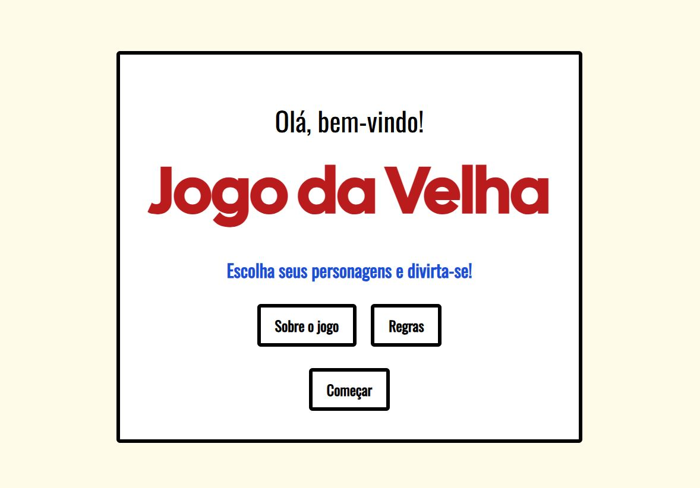

## Jogo da Velha com Modal de Fim de Jogo

Este projeto é um jogo da velha desenvolvido em React com TypeScript. Ele possui modos para 1 jogador (contra a máquina) e 2 jogadores, utilizando React Router para navegação entre as telas e estilizações responsivas com Tailwind CSS. Um modal estilizado é exibido ao final do jogo para exibir informações relevantes.

# Funcionalidades

1. Modos de Jogo

   Modo 1 Jogador: O jogador enfrenta uma máquina com movimentos aleatórios.

   Modo 2 Jogadores: Dois jogadores podem jogar alternadamente no mesmo dispositivo.

2. Tela de Fim de Jogo

   Exibe o vencedor (Jogador 1, Jogador 2 ou Máquina) e a jogada vencedora.

   Inclui botão para reiniciar o jogo.

3. Modal

   Modal responsivo para exibir mensagens informativas.

   Possui funcionalidade para fechar o modal manualmente.

4. Estilização

   Layout responsivo com Tailwind CSS.

   Modal estilizado com suporte para textos longos e rolagem.

   Tecnologias Utilizadas

   React: Biblioteca principal para criar a interface do usuário.

   TypeScript: Para tipagem estática e maior segurança no código.

   React Router: Para navegação entre telas (Jogo e Tela de Fim de Jogo).

   Tailwind CSS: Para estilização responsiva e customizada.

# Como Executar o Projeto

    Clone o repositório:

    ```bash
    git clone https://github.com/seu-usuario/seu-repositorio.git
    ```

    Acesse o diretório do projeto:

    ```bash
    cd seu-repositorio
    ```

    Instale as dependências:

    ```bash
    npm install
    ```

    Inicie o servidor de desenvolvimento:

    ```bash
    npm start
    ```

    No navegador, acesse:

    http://localhost:3000

# Estrutura do Projeto

    ```bash
    ├── src
    ├── components
    │ ├── Button.tsx # Botão reutilizável
    │ └── Container.tsx # Container para layout
    │ └── Modal.tsx # Componente de Modal
    ├── pages
    | |── Home.tsx # Página de entrada
    | |── CharacterSelect.tsx # Seleção de Figuras
    │ ├── GameBoard.tsx # Lógica e interface do jogo
    │ └── GameOver.tsx # Tela de fim de jogo
    ├── App.tsx # Configuração das rotas
    └── index.tsx # Ponto de entrada
    ```

# Jogadas da Máquina

Implementação de lógica simples para que a máquina escolha uma jogada aleatória.

# Contribuições

Contribuições são bem-vindas! Sinta-se à vontade para abrir issues ou enviar pull requests no repositório.

# Licença

Este projeto é público. Pode usar.
